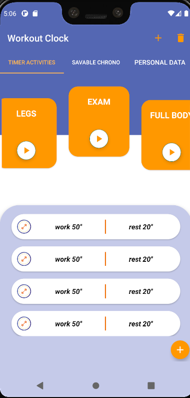

# Advanced Workout Clock

This Android Application is meant to generate a clock with features to make any work-out related activity more efficent.

## Basic features of the app

* The user can create an activity for the chronometer and store the timings he does for the activities. The timings are visible and deletable.

* The user can create an activity for an interval timer and schedule the timings to do, that are also divided into work and rest. The interval timer can be stopped, paused, resetted and fast forwarded. 

* The data stored for the chronometer and for the timer will be plotted into graphs. The graphs types are not chosen yet.

* The app support 4 languages: English (default), France, Spanish, Italian.


## Front-End

The front-end is made by following **material design guidelines** for Android.

* The application supports [ViewPager 2](https://developer.android.com/jetpack/androidx/releases/viewpager2) to show the fragments.

* The item list of the timer supports **swipe and drag callbacks** with RecyclerView and it has a customized NestedScrollView in the timer acivities tab to optimize the space taken.

* The timer and the chronometer uses [Material Progress Bar](https://github.com/zhanghai/MaterialProgressBar)

 




## Back-End

The interval timer uses the **Shared Preferences** of the phone in order not to lose the timings already done. 

Every part of the application uses **MVP pattern** in order the seprate the development. This make every part testable and highly flexible: a programmer can implement the database ingoring the other components.
Every component of the pattern implements the interface defined in the contract package.

Since I attach a presenter to a fragment, the **presenter need to be almost stateless** beacuse they are on different layers of architecture and lifecycle.
The only un-stateless parts of the presenter are connected to the db.


### Presenter pseudocode

```
override fun presenterExapmle(args)
{
    if (model == null)
    {   view.notifyUserInternalError(); return   }

    if (checkConditions(args)== ERROR)
    {    view.displayTheError(); return }

    doTheLogic()

    model!!.interactWithModel()

    view.displayResults("R.string.SomeResultString")
}
```
