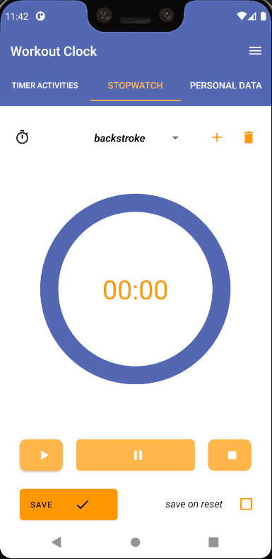
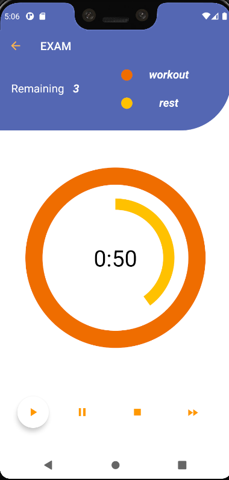

# Advanced Workout Clock

This Android Application is meant to generate a clock with some features to make any kind of timed activity more efficent, and to plot the resulting data.

## Features of the app

* The user can create an activity for the chronometer and store the timings he did for the activities.

* The user can create an activity for the timer and schedule one or more timers that are also divided into work and rest.

* I will plot the data stored for chronometer and for timer into some graphs. The graphs types are not chosen yet.

## Front-End

The front end is done with material features and styles for Android.

The app supports swipe and drag with RecyclerView and it has a NestedScrollView in the timer acivities tab. 

 

## Back-End

The back end uses MVP pattern in order the seprate the logic from the model and the view and to every part testable and highly flexible.

Since I attach a presenter to a fragment, the presenter need to be almost stateless beacuse they are on different layers of architecture and lifecycle.
The only un-stateless parts of the presenter are connected to the db.

